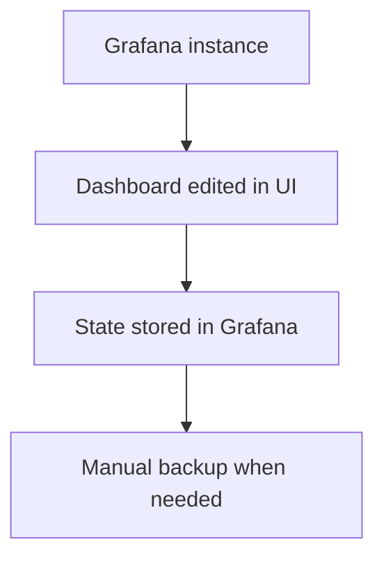
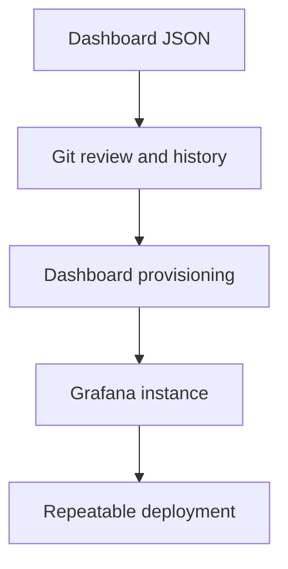
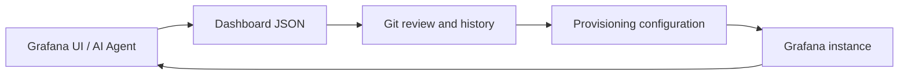
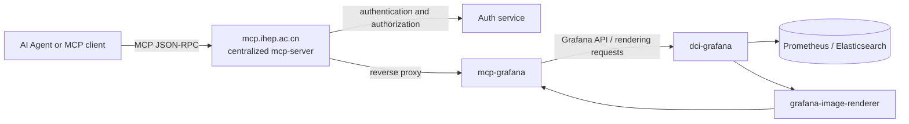
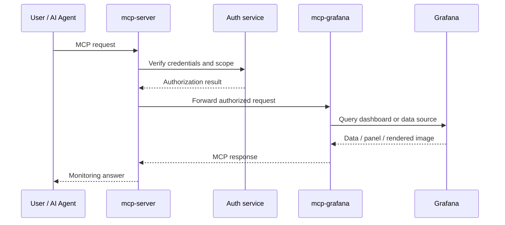
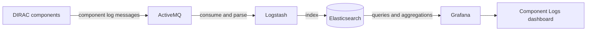

<!-- transition: slide-up -->

## Monitoring upgrades for the JUNO DCI system

**Xiao Han** <a href="mailto:hanx@ihep.ac.cn"><Email v="hanx@ihep.ac.cn" /></a>

28th JUNO Collaboration Meeting · **20 July 2026 · Beijing, IHEP**

<a href="https://dci-grafana.ihep.ac.cn/"><mdi-open-in-new />DCI Grafana</a>

<a href="https://github.com/hanx-hep/27th-junocm-dci" class="ns-c-iconlink"><mdi-open-in-new />Previous collaboration-meeting report</a>

---
layout: side-title
title: Table of Contents
color: rose-light
align: cm-lm
---

:: title ::

# Table of Contents

:: content ::

- *From backup to dashboard provisioning*
- *Dashboard provisioning in practice*
- *MCP access to Grafana*
- *Centralized DIRAC component logs*
- *Summary and next steps*

---
layout: section
color: cyan-light
---

# From backup to dashboard provisioning

---
layout: top-title-two-cols
color: gray-light
align: c-l-l
---

:: title ::

# Grafana monitoring has moved to dashboard provisioning

:: left ::

## Previous workflow



Dashboard definitions were mainly kept inside the running Grafana service. Changes were harder to review, reproduce, and transfer.

:: right ::

## Current workflow



Dashboard definitions are version-controlled and loaded by Grafana provisioning providers. The same repository can reconstruct the monitoring layout.

---
layout: top-title-two-cols
color: gray-light
align: c-l-l
---

:: title ::

# Dashboard provisioning in practice

:: left ::

## 1. Register a provisioning provider

```yaml
# grafana/provisioning/dashboards/dashboards.yaml
apiVersion: 1

providers:
  - name: tpc
    orgId: 1
    folder: TPC
    type: file
    updateIntervalSeconds: 30
    allowUiUpdates: true
    options:
      path: /etc/grafana/provisioning/dashboards/tpc
```

:: right ::

## 2. Mount the repository into Grafana

```yaml
# docker-compose.yml
services:
  grafana-server:
    volumes:
      - /home/docker/grafana/provisioning:
          /etc/grafana/provisioning
    environment:
      - GF_RENDERING_SERVER_URL=
          http://grafana-renderer:8081/render
```

The dashboard JSON files are then discovered from the mounted provider path and loaded by Grafana. Git changes become deployable configuration changes.

---
layout: top-title
color: gray-light
align: c
---

:: title ::

# Dashboard provisioning workflow

:: content ::



### What this changes

Dashboard changes become reviewable commits rather than opaque state inside a running service. A deployment can be reconstructed from version-controlled files, and an agent can work directly with structured dashboard definitions.

---
layout: top-title-two-cols
color: green-light
align: c-l-l
---

:: title ::

# Why configuration helps AI-assisted operations

:: left ::

## Structured input

Panels, queries, transformations, variables, and layout are explicit JSON objects. An agent can inspect the existing design and extend it without starting from a blank dashboard.

## Reviewable output

The result is a normal Git change: it can be diffed, discussed, tested, and reverted.

:: right ::

## A practical example

Starting from the existing TPC monitoring dashboard, an AI Agent helped organize a complex transfer test matrix with consistent columns, multiple transfer modes, average panels, state timelines, and grading.

The important improvement is the workflow: domain knowledge remains with the operator, while repetitive dashboard composition becomes easier to automate.

---
layout: section
color: purple-light
---

# AI-assisted TPC transfer monitoring

---
layout: top-title-two-cols
color: gray-light
align: c-l-l
---

:: title ::

# TPC Transfer Monitoring: a test matrix in Grafana

:: left ::

## Matrix dimensions

The dashboard compares transfer status across source site, destination site, success state, and copy mode. It presents the latest status as grids and the historical behavior as state timelines.

The tracked modes include **pull**, **push**, **streamed**, and **all**.

:: right ::

## Current dashboard structure

The version-controlled dashboard contains 12 panels, including latest-status grids, an all-mode average grid, per-mode average success-rate tables, and state timelines.

<a href="https://dci-grafana.ihep.ac.cn/d/tpc-transfer-monitoring/tpc-transfer-monitoring?var-timeInterval=1d&orgId=1&from=now-7d&to=now&timezone=browser&var-srcsite=$__all&var-dessite=$__all&var-success=$__all&var-copymode=$__all&refresh=1m"><mdi-open-in-new />Open the live TPC test matrix</a>

---
layout: top-title
color: gray-light
align: c
---

:: title ::

# Live view: TPC transfer matrix

:: content ::

<div style="width: 100%; height: 45vh; overflow: hidden;">
  <iframe
    src="https://dci-grafana.ihep.ac.cn/d/tpc-transfer-monitoring/tpc-transfer-monitoring?var-timeInterval=1d&orgId=1&from=now-7d&to=now&timezone=browser&var-srcsite=$__all&var-dessite=$__all&var-success=$__all&var-copymode=$__all&refresh=1m&kiosk"
    style="width: 200%; height: 90vh; transform: scale(0.5); transform-origin: 0 0; border: 0;"
  ></iframe>
</div>

<div class="text-center text-sm text-gray-500">The embedded view is live and may require access to dci-grafana.ihep.ac.cn.</div>

---
layout: section
color: lime-light
---

# Grafana through the IHEP MCP system

---
layout: top-title
color: gray-light
align: c
---

:: title ::

# MCP-Grafana architecture

:: content ::



The centralized server is the controlled entry point. It authenticates the request, forwards the authorized MCP call to `mcp-grafana`, and keeps the Grafana service behind the gateway boundary.

---
layout: top-title-two-cols
color: gray-light
align: c-l-l
---

:: title ::

# What MCP adds to monitoring

:: left ::

## Query and inspect

An AI client can ask for dashboard information, query monitoring data, inspect panels, and retrieve results through a standardized MCP interface.

This turns Grafana from a human-only visualization endpoint into a service that can participate in an operational workflow.

:: right ::

## Preview and explain

The `grafana/grafana-image-renderer` plugin provides the rendering capability needed by MCP-Grafana to preview dashboard panels and views.

The agent can combine structured query results with visual context when diagnosing a system or preparing a report.

---
layout: top-title
color: gray-light
align: c
---

:: title ::

# From a question to a monitoring answer

:: content ::



This separates centralized identity and policy from the Grafana-specific implementation, while preserving a single authenticated entry point at `mcp.ihep.ac.cn`.

---
layout: section
color: red-light
---

# Centralized DIRAC component logs

---
layout: top-title
color: gray-light
align: c
---

:: title ::

# DIRAC log pipeline

:: content ::



The new chain centralizes component logs instead of leaving diagnosis dependent on individually accessing service hosts. It complements the existing Prometheus-based infrastructure and service metrics.

---
layout: top-title-two-cols
color: gray-light
align: c-l-l
---

:: title ::

# Component Logs dashboard

:: left ::

## Operational view

The dashboard provides three complementary views:

The log-level distribution shows the balance of information, warning, and error messages. A time series shows changes over time, while a table exposes the individual records for investigation.

Variables allow filtering by **Category**, **Name**, and **Level**.

:: right ::

<a href="https://dci-grafana.ihep.ac.cn/d/bfgu666p30xdsb/component-logs?orgId=1&from=now-24h&to=now&timezone=browser&var-Category=$__all&var-Name=$__all&var-Level=$__all"><mdi-open-in-new />Open the live Component Logs dashboard</a>

<div style="width: 100%; height: 30vh; overflow: hidden; margin-top: 1rem;">
  <iframe
    src="https://dci-grafana.ihep.ac.cn/d/bfgu666p30xdsb/component-logs?orgId=1&from=now-24h&to=now&timezone=browser&var-Category=$__all&var-Name=$__all&var-Level=$__all&kiosk"
    style="width: 200%; height: 60vh; transform: scale(0.5); transform-origin: 0 0; border: 0;"
  ></iframe>
</div>

---
layout: top-title-two-cols
color: green-light
align: c-l-l
---

:: title ::

# Monitoring is moving from display to diagnosis

:: left ::

## Three complementary layers

**Metrics** describe resource usage and service behavior through Prometheus. **Logs** provide event-level context through Elasticsearch. **Dashboards** combine the two into operational views for people and agents.

:: right ::

## Practical benefits

The upgrades make it easier to reproduce a monitoring environment, compare changes over time, build a transfer test matrix, and follow a DIRAC problem from a high-level symptom to the responsible component log.

The MCP layer creates an additional path for automated inspection and explanation.

---
layout: section
color: orange-light
---

# Summary and next steps

---
layout: top-title
color: gray-light
align: c
---

:: title ::

# Summary

:: content ::

- Grafana dashboards have moved from mostly instance-local state to version-controlled configuration.
- The TPC transfer matrix demonstrates how structured dashboards can be extended efficiently with AI assistance.
- MCP-Grafana is exposed through the authenticated, centralized IHEP MCP server and can use Grafana rendering for previews.
- DIRAC component logs now follow a centralized ActiveMQ → Logstash → Elasticsearch → Grafana path.
- Together, these changes improve reproducibility, collaboration, observability, and the potential for AI-assisted operations.

### Next steps

Continue expanding dashboard coverage, add more actionable alerts, expose carefully scoped monitoring tools through MCP, and standardize the workflow for reviewing and deploying AI-assisted dashboard changes.

---
layout: credits
color: navy
loop: true
speed: 0.8
title: credits/people
---

<div class="grid text-size-4 grid-cols-3 w-3/4 gap-y-10 auto-rows-min ml-auto mr-auto">
    <div class="grid-item text-center mr-0 col-span-3">
        <strong>DCI monitoring</strong><br>
    </div>
    <div class="grid-item text-right mr-4 col-span-1">
        <strong>Reporter</strong>
    </div>
    <div class="grid-item col-span-2">
        Xiao Han <i>IHEP, CC</i><br/>
    </div>
    <div class="grid-item text-right mr-4 col-span-1">
        <strong>Systems</strong>
    </div>
    <div class="grid-item col-span-2">
        JUNO DCI · Grafana · DIRAC · IHEP MCP<br/>
    </div>
</div>

<div class="text-center mt-24 text-2xl">
    <strong>Questions?</strong>
</div>
<div class="text-center mt-12 text-3xl">
    Thank you!
</div>

<style>
.mermaid {
    display: flex;
    justify-content: center;
    overflow: visible;
}

.mermaid > svg {
    max-width: 100%;
    height: auto;
}
</style>
