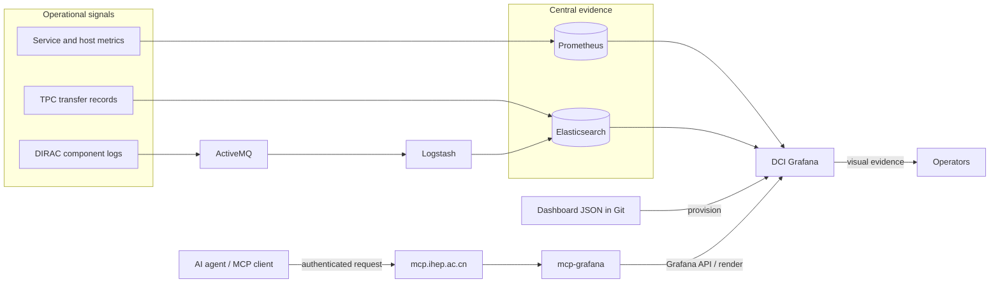
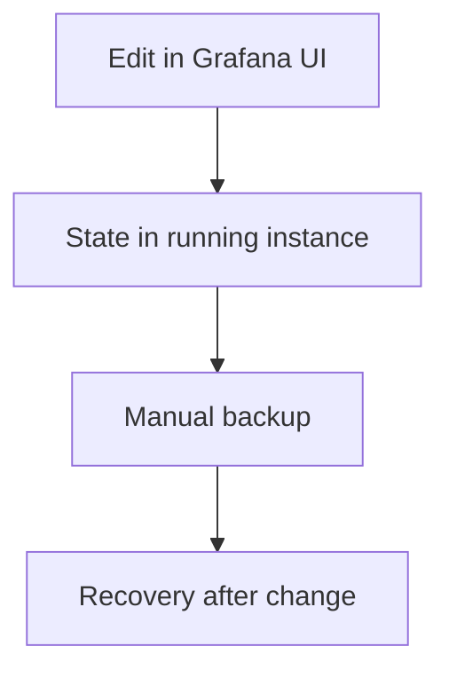
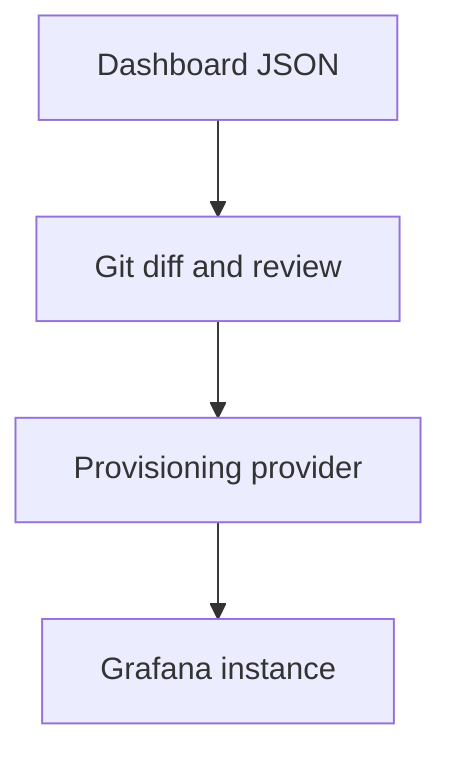
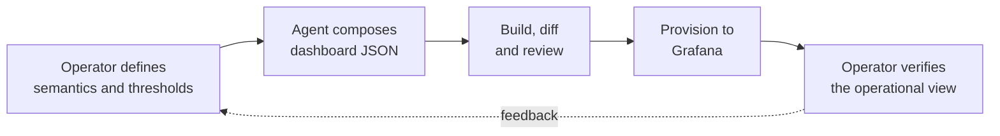
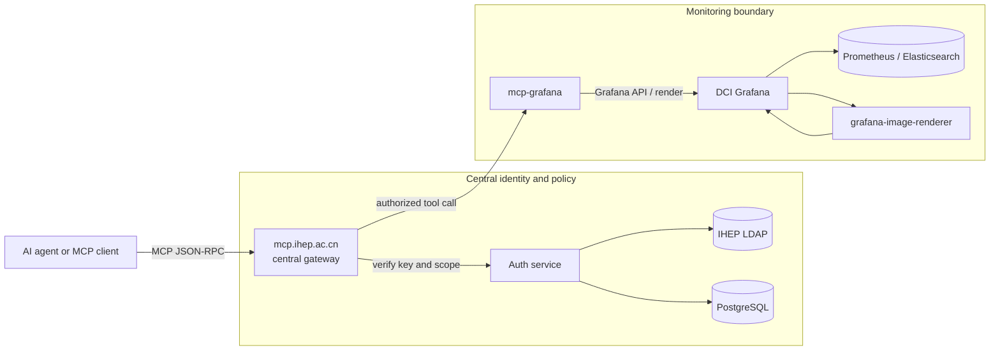
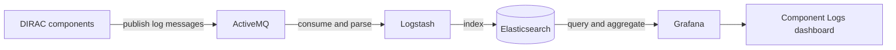
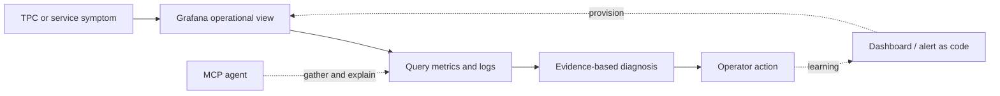

<!-- transition: slide-up -->

# From dashboards to diagnosis

## Monitoring upgrades for the JUNO DCI

**Xiao Han** on behalf of the DCI Group 
<a href="mailto:hanx@ihep.ac.cn"><Email v="hanx@ihep.ac.cn" /></a>

**28th JUNO Collaboration Meeting · 20 July 2026 · Beijing IHEP**

<a href="https://github.com/hanx-hep/28th-junocm-dci" class="ns-c-iconlink"><mdi-github /> Slides</a>
 · <a href="https://dci-grafana.ihep.ac.cn/" class="ns-c-iconlink"><mdi-view-dashboard-outline /> DCI Grafana</a>
 · <a href="https://hanx-hep.github.io/27th-junocm-dci/" class="ns-c-iconlink"><mdi-history /> 27th report</a>

---
layout: top-title
color: gray-light
align: c
---

:: title ::

# The upgrade is a shorter path from signal to action

:: content ::

Monitoring is becoming an <strong>operational system</strong>, not only a collection of dashboards.

  

    <mdi-source-branch class="story-icon" />
    <h2>Reproducible</h2>
    
Dashboard JSON and provisioning live in Git, so changes can be reviewed and deployments reconstructed.

  

  

    <mdi-layers-search class="story-icon" />
    <h2>Diagnosable</h2>
    
Metrics show the symptom; centralized component logs provide the event-level context behind it.

  

  

    <mdi-robot-outline class="story-icon" />
    <h2>Accessible</h2>
    
Operators use Grafana directly; agents reach the same evidence through the controlled IHEP MCP gateway.

  

<strong>Goal:</strong> reduce the time between “something is wrong” and “this is the next useful action.”

---
layout: top-title
color: gray-light
align: c
---

:: title ::

# One monitoring loop, three upgrades

:: content ::

  <strong>Foundation</strong> · Git + provisioning
  <strong>Evidence</strong> · Prometheus + Elasticsearch
  <strong>Interfaces</strong> · Grafana + MCP

---
layout: section
color: cyan-light
---

# 1 · Make dashboards reproducible

---
layout: top-title-two-cols
color: gray-light
align: c-l-l
---

:: title ::

# Provisioning moves the control point into Git

:: left ::

## Before · instance state

The running service was the main source of truth. A backup could recover state, but it did not make each change easy to review, reproduce, or transfer.

:: right ::

## Now · delivery path

The repository becomes the durable definition of the monitoring layout. The instance reconciles that definition on deployment and during provider refresh.

Backup protects the past. Provisioning controls the next change.

---
layout: top-title
color: gray-light
align: c
---

:: title ::

# The repository is now an operational control surface

:: content ::

  
<strong>10</strong>Admin

  
<strong>9</strong>DIRAC

  
<strong>6</strong>TPC

  
<strong>4</strong>User

  
<strong>2</strong>Shift

  
<small>CREATE</small><strong>UI or agent</strong>

  <mdi-arrow-right />
  
<small>CAPTURE</small><strong>Dashboard JSON</strong>

  <mdi-arrow-right />
  
<small>CONTROL</small><strong>Git review</strong>

  <mdi-arrow-right />
  
<small>RECONCILE</small><strong>30 s refresh</strong>

  
<strong>31 dashboard files</strong> Five providers reconstruct the current folder layout from version-controlled JSON.

  
<strong>Guard against drift</strong> <code>allowUiUpdates: true</code> keeps UI editing convenient; export → review → commit must remain the return path to Git.

---
layout: top-title
color: gray-light
align: c
---

:: title ::

# TPC transfer matrix: failures become patterns

:: content ::

  <strong>4 modes</strong> · pull / push / streamed / all
  <strong>12 panels</strong> · 8 tables + 4 state timelines
  <strong>5 variables</strong> · time, sites, state, mode

A grid turns individual transfer results into site-, direction-, and mode-correlated failure patterns. Snapshot: 17 July 2026 · last 7 days.

---
layout: top-title
color: green-light
align: c
---

:: title ::

# AI assistance belongs inside the review loop

:: content ::

  
<strong>Good use of automation</strong> Repeat panel structure, queries, transformations, variables, and layout consistently across a test matrix.

  
<strong>Human control remains explicit</strong> Domain meaning, grading thresholds, acceptance, and operational action stay with the operator.

The benefit is not “AI made a dashboard.” It is <strong>faster composition with a normal Git review boundary</strong>.

---
layout: section
color: purple-light
---

# 2 · Give agents controlled access

---
layout: top-title
color: gray-light
align: c
---

:: title ::

# MCP adds a controlled machine interface to Grafana

:: content ::

  
<strong>Policy stays centralized</strong> One authenticated gateway enforces identity and scope.

  
<strong>Grafana stays behind the boundary</strong> <code>mcp-grafana</code> adapts dashboard metadata, queries, and rendering.

---
layout: top-title
color: gray-light
align: c
---

:: title ::

# From an operational question to evidence

:: content ::

  
<small>1 · ASK</small><strong>“Why is TPC push failing for a site pair?”</strong>

  <mdi-arrow-right />
  
<small>2 · AUTHORIZE</small><strong>Gateway verifies key and scope</strong>

  <mdi-arrow-right />
  
<small>3 · INSPECT</small><strong>Query data and render the relevant panel</strong>

  <mdi-arrow-right />
  
<small>4 · EXPLAIN</small><strong>Return evidence and the next diagnostic step</strong>

  
<mdi-code-json /><strong>Structured evidence</strong>dashboard definitions, variables, queries, and data results

  
<mdi-image-search-outline /><strong>Visual evidence</strong>rendered panels preserve the pattern an operator would see

  
<mdi-shield-account-outline /><strong>Operational boundary</strong>the agent gathers and explains; remediation remains an explicit action

MCP is an access path to monitoring evidence — <strong>not another monitoring data source</strong>.

---
layout: section
color: lime-light
---

# 3 · Put logs beside metrics

---
layout: top-title
color: gray-light
align: c
---

:: title ::

# Central logs close the context gap

:: content ::

  
<small>METRICS</small><strong>What changed?</strong>Resource and service behavior reveal the symptom.

  
<small>TIMELINE</small><strong>When did it start?</strong>Central timestamps define the relevant diagnostic window.

  
<small>LOG RECORDS</small><strong>Which component explains it?</strong>Event-level context replaces host-by-host inspection.

Prometheus and Elasticsearch answer different questions; Grafana brings both into the same operational workflow.

---
layout: top-title
color: gray-light
align: c
---

:: title ::

# The Component Logs dashboard follows the triage sequence

:: content ::

  

    

    
<small>1 · DISTRIBUTION</small><h2>Is the error mix abnormal?</h2>
One pie panel compares information, warning, and error volume.

  

  

    <svg class="mock-line" viewBox="0 0 240 90" aria-label="example log volume timeline"><polyline points="0,70 25,66 50,68 75,42 100,54 125,20 150,35 175,28 200,60 240,48" /></svg>
    
<small>2 · TIMELINE</small><h2>When did the change begin?</h2>
One time-series panel narrows the investigation window.

  

  

    
<i></i><i></i><i></i><i></i>

    
<small>3 · RECORDS</small><h2>Which message is actionable?</h2>
One table exposes the individual records for investigation.

  

  <strong>Filter the same evidence by</strong>
  CategoryNameLevel
  <a href="https://dci-grafana.ihep.ac.cn/d/bfgu666p30xdsb/component-logs?orgId=1&from=now-24h&to=now"><mdi-open-in-new /> Open live dashboard</a>

---
layout: top-title
color: green-light
align: c
---

:: title ::

# The operational loop is now connected

:: content ::

  
<strong>Grafana</strong>makes the pattern visible

  
<strong>Metrics + logs</strong>provide complementary evidence

  
<strong>MCP agent</strong>shortens evidence gathering

  
<strong>Operator</strong>owns judgment and action

The architecture connects observation to diagnosis while keeping change review and operational authority explicit.

---
layout: top-title-two-cols
color: gray-light
align: c-l-l
---

:: title ::

# Delivered now, with a clear next increment

:: left ::

## Delivered

  
<mdi-check-circle-outline /><strong>Dashboard provisioning</strong> 31 JSON dashboards under five providers

  
<mdi-check-circle-outline /><strong>TPC transfer view</strong> 12 panels across four transfer modes

  
<mdi-check-circle-outline /><strong>Controlled MCP path</strong> Central gateway to <code>mcp-grafana</code>

  
<mdi-check-circle-outline /><strong>Central component logs</strong> Three complementary diagnostic panels

:: right ::

## Next increment

  
<mdi-arrow-right-circle-outline /><strong>Actionable alerts</strong> Thresholds, ownership, and response links

  
<mdi-arrow-right-circle-outline /><strong>Dashboard release checks</strong> Build, schema, and screenshot smoke tests

  
<mdi-arrow-right-circle-outline /><strong>Scoped MCP operations</strong> Read-first tools with explicit authorization

  
<mdi-arrow-right-circle-outline /><strong>Metrics-to-logs drill-down</strong> Carry site, component, and time context

---
layout: top-title
color: green-light
align: c
---

:: title ::

# Three takeaways

:: content ::

  
<strong>1</strong><h2>Reproducible</h2>
Git and provisioning turn dashboard changes into reviewable, reconstructable configuration.

  
<strong>2</strong><h2>Diagnosable</h2>
TPC views expose patterns; centralized logs explain the component events behind them.

  
<strong>3</strong><h2>Accessible</h2>
The same Grafana evidence serves operators directly and agents through the IHEP MCP gateway.

The key upgrade is not another dashboard. 
It is a <strong>shorter, controlled path from signal to action</strong>.

---
layout: cover
color: navy
loop: true
title: Questions
---

# Questions?

## Thank you

**Xiao Han · IHEP, CC** 
DCI Group · JUNO Collaboration

<a href="https://dci-grafana.ihep.ac.cn/" class="ns-c-iconlink"><mdi-view-dashboard-outline /> dci-grafana.ihep.ac.cn</a>
 · <a href="https://github.com/hanx-hep/28th-junocm-dci" class="ns-c-iconlink"><mdi-github /> slides & source</a>
