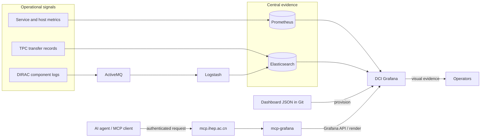
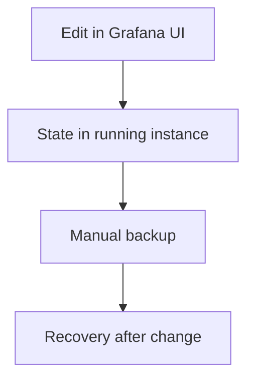
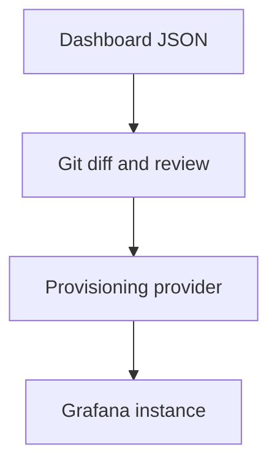
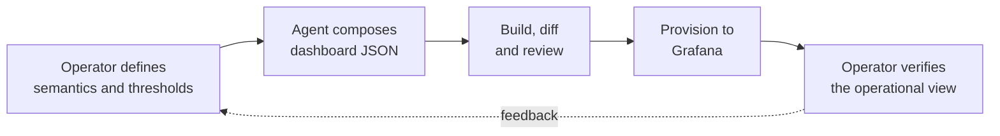
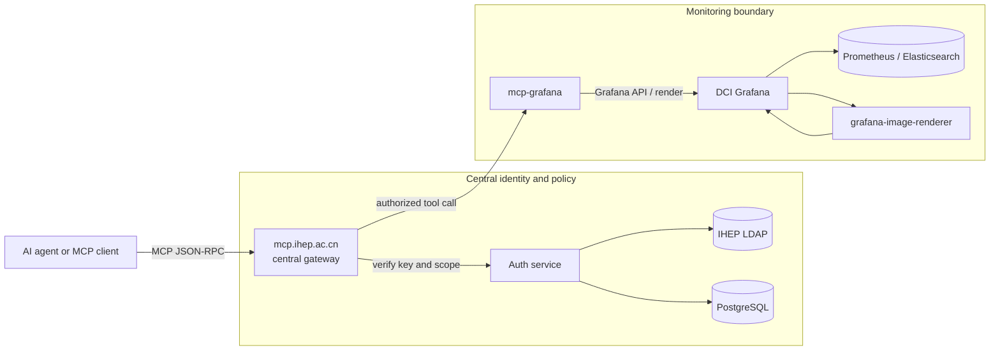
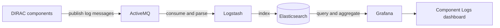
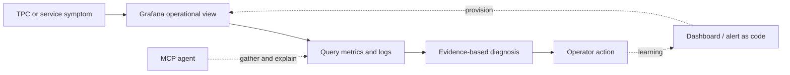

<!-- transition: slide-up -->

# From dashboards to diagnosis

## Monitoring upgrades for the JUNO DCI

**Xiao Han** on behalf of the DCI Group 
<a href="mailto:hanx@ihep.ac.cn"><Email v="hanx@ihep.ac.cn" /></a>

**28th JUNO Collaboration Meeting · 20 July 2026 · Beijing IHEP**

<a href="https://github.com/hanx-hep/28th-junocm-dci" class="ns-c-iconlink"><mdi-github /> Slides</a>
 · <a href="https://dci-grafana.ihep.ac.cn/" class="ns-c-iconlink"><mdi-view-dashboard-outline /> DCI Grafana</a>
 · <a href="https://hanx-hep.github.io/27th-junocm-dci/" class="ns-c-iconlink"><mdi-history /> 27th report</a>

<!--
Timing: 0:35

Good afternoon, everyone. I am Xiao Han, presenting on behalf of the DCI Group. Today I will report the latest monitoring upgrades for the JUNO distributed computing infrastructure. The title, “From dashboards to diagnosis,” summarizes the direction of this work. We are not only adding more charts. We are connecting configuration, monitoring evidence, and controlled agent access so that an operational symptom can lead more quickly to a useful diagnosis and a clear next action.
-->
---
layout: top-title
color: gray-light
align: c
---

:: title ::

# The upgrade is a shorter path from signal to action

:: content ::

Monitoring is becoming an <strong>operational system</strong>, not only a collection of dashboards.

  

    <mdi-source-branch class="story-icon" />
    <h2>Reproducible</h2>
    
Dashboard JSON and provisioning live in Git, so changes can be reviewed and deployments reconstructed.

  

  

    <mdi-layers-search class="story-icon" />
    <h2>Diagnosable</h2>
    
Metrics show the symptom; centralized component logs provide the event-level context behind it.

  

  

    <mdi-robot-outline class="story-icon" />
    <h2>Accessible</h2>
    
Operators use Grafana directly; agents reach the same evidence through the controlled IHEP MCP gateway.

  

<strong>Goal:</strong> reduce the time between “something is wrong” and “this is the next useful action.”

<!--
Timing: 0:55

The main message is shown on this slide. Monitoring is becoming an operational system rather than a collection of independent dashboards. We are improving three properties. First, it is reproducible: dashboard definitions and provisioning are kept in Git. Second, it is diagnosable: metrics show the symptom, while centralized logs explain the events behind it. Third, it is accessible: operators use Grafana directly, and agents can reach the same evidence through the controlled IHEP MCP gateway. The goal is simple—to shorten the time between noticing that something is wrong and knowing the next useful action.
-->
---
layout: top-title
color: gray-light
align: c
---

:: title ::

# One monitoring loop, three upgrades

:: content ::

  <strong>Foundation</strong> · Git + provisioning
  <strong>Evidence</strong> · Prometheus + Elasticsearch
  <strong>Interfaces</strong> · Grafana + MCP

<!--
Timing: 1:10

This diagram gives the complete picture. On the left are the operational signals: service and host metrics, TPC transfer records, and DIRAC component logs. Metrics go to Prometheus. Transfer records and centralized logs are available through Elasticsearch, with component logs passing through ActiveMQ and Logstash. Grafana brings these data sources together as the operational view. Dashboard JSON in Git is provisioned into Grafana, so the visual layer is also controlled configuration. Operators inspect Grafana directly. An AI agent reaches Grafana through the centralized MCP gateway and the mcp-grafana adapter. These are the three upgrades I will discuss: a reproducible foundation, richer evidence, and controlled interfaces.
-->
---
layout: section
color: cyan-light
---

# 1 · Make dashboards reproducible

<!--
Timing: 0:15

I will begin with the foundation: making dashboards reproducible. This sounds like a configuration detail, but it changes how safely we can review, deploy, and recover the monitoring environment.
-->
---
layout: top-title-two-cols
color: gray-light
align: c-l-l
---

:: title ::

# Provisioning moves the control point into Git

:: left ::

## Before · instance state

The running service was the main source of truth. A backup could recover state, but it did not make each change easy to review, reproduce, or transfer.

:: right ::

## Now · delivery path

The repository becomes the durable definition of the monitoring layout. The instance reconciles that definition on deployment and during provider refresh.

Backup protects the past. Provisioning controls the next change.

<!--
Timing: 1:05

Previously, the running Grafana instance was effectively the main source of truth. We edited dashboards in the UI, Grafana stored the state, and a manual backup protected us if recovery was needed. A backup is useful, but it does not give a clear review path for every change. In the current workflow, dashboard JSON is stored in Git, reviewed as a normal diff, and loaded through a provisioning provider. This makes the monitoring layout reconstructable and makes changes visible before deployment. The distinction at the bottom is important: backup protects the past, while provisioning controls the next change.
-->
---
layout: top-title
color: gray-light
align: c
---

:: title ::

# The repository is now an operational control surface

:: content ::

  
<strong>10</strong>Admin

  
<strong>9</strong>DIRAC

  
<strong>6</strong>TPC

  
<strong>4</strong>User

  
<strong>2</strong>Shift

  
<small>CREATE</small><strong>UI or agent</strong>

  <mdi-arrow-right />
  
<small>CAPTURE</small><strong>Dashboard JSON</strong>

  <mdi-arrow-right />
  
<small>CONTROL</small><strong>Git review</strong>

  <mdi-arrow-right />
  
<small>RECONCILE</small><strong>30 s refresh</strong>

  
<strong>31 dashboard files</strong> Five providers reconstruct the current folder layout from version-controlled JSON.

  
<strong>Guard against drift</strong> <code>allowUiUpdates: true</code> keeps UI editing convenient; export → review → commit must remain the return path to Git.

<!--
Timing: 1:10

The repository now contains 31 dashboard files under five providers: Admin, DIRAC, TPC, User, and Shift. The delivery loop is create, capture, control, and reconcile. An operator or an agent can compose a dashboard, but the result must return as dashboard JSON. Git is the review boundary, and Grafana refreshes the provider every 30 seconds. One guardrail deserves attention: UI updates are still allowed for convenience. Therefore, an edit made in Grafana must be exported, reviewed, and committed. Otherwise, the running instance can drift away from the repository. Git remains the durable source of truth.
-->
---
layout: top-title
color: gray-light
align: c
---

:: title ::

# TPC transfer matrix: failures become patterns

:: content ::

  <iframe
    src="https://dci-grafana.ihep.ac.cn/d/tpc-transfer-monitoring/tpc-transfer-monitoring?var-timeInterval=1d&orgId=1&from=now-7d&to=now&timezone=browser&var-srcsite=$__all&var-dessite=$__all&var-success=$__all&var-copymode=$__all&kiosk"
    scrolling="yes"
    style="width: 250%; height: 145vh; transform: scale(0.4); transform-origin: 0 0; border: 0;"
  ></iframe>

  <strong>Interactive live view</strong> · scroll vertically to compare pull, push, streamed, and all modes.
  <a href="https://dci-grafana.ihep.ac.cn/d/tpc-transfer-monitoring/tpc-transfer-monitoring?var-timeInterval=1d&orgId=1&from=now-7d&to=now&timezone=browser&var-srcsite=$__all&var-dessite=$__all&var-success=$__all&var-copymode=$__all&kiosk"><mdi-open-in-new /> Open full dashboard</a>

<!--
Timing: 1:20

This is the live TPC transfer monitoring dashboard. It may take a moment to load. At the top, we can filter by time interval, source site, destination site, success state, and copy mode. The dashboard contains 12 panels: eight tables and four state timelines, covering pull, push, streamed, and combined modes.

[Demo: scroll vertically through the matrix and compare at least two copy modes.]

The value of the matrix is correlation. A single failed transfer is only an event. A repeated row, column, or mode pattern suggests that the problem follows a site, a direction, or a transfer method. The average panels also help distinguish a transient failure from persistent degradation. This turns many individual test records into a compact operational signal.
-->
---
layout: top-title
color: green-light
align: c
---

:: title ::

# AI assistance belongs inside the review loop

:: content ::

  
<strong>Good use of automation</strong> Repeat panel structure, queries, transformations, variables, and layout consistently across a test matrix.

  
<strong>Human control remains explicit</strong> Domain meaning, grading thresholds, acceptance, and operational action stay with the operator.

The benefit is not “AI made a dashboard.” It is <strong>faster composition with a normal Git review boundary</strong>.

<!--
Timing: 0:55

The TPC dashboard also demonstrates where AI assistance is useful. The operator defines the semantics, the transfer modes, the thresholds, and what the colors mean. The agent can then handle repetitive dashboard composition: panel structure, queries, transformations, variables, and layout. The output is built, diffed, and reviewed before provisioning. Finally, the operator verifies the operational view. So the important result is not that AI made a dashboard. The result is faster composition while preserving a normal Git review boundary and explicit human control.
-->
---
layout: section
color: purple-light
---

# 2 · Give agents controlled access

<!--
Timing: 0:15

The second upgrade is controlled machine access. Once monitoring evidence is structured, an agent can use it—but only through a clear authentication and authorization boundary.
-->
---
layout: top-title
color: gray-light
align: c
---

:: title ::

# MCP adds a controlled machine interface to Grafana

:: content ::

  
<strong>Policy stays centralized</strong> One authenticated gateway enforces identity and scope.

  
<strong>Grafana stays behind the boundary</strong> <code>mcp-grafana</code> adapts dashboard metadata, queries, and rendering.

<!--
Timing: 1:15

The client does not connect directly to Grafana. It sends an MCP JSON-RPC request to the centralized gateway at mcp.ihep.ac.cn. The gateway verifies the key and scope through the authentication service, which is connected to IHEP LDAP and PostgreSQL. Only an authorized tool call is forwarded to mcp-grafana. Inside the monitoring boundary, mcp-grafana uses the Grafana API and rendering interface. Grafana reads Prometheus and Elasticsearch and can use the image renderer for visual context. This separation gives us two useful properties: identity and policy stay centralized, while Grafana-specific behavior stays inside a dedicated adapter.
-->
---
layout: top-title
color: gray-light
align: c
---

:: title ::

# From an operational question to evidence

:: content ::

  
<small>1 · ASK</small><strong>“Why is TPC push failing for a site pair?”</strong>

  <mdi-arrow-right />
  
<small>2 · AUTHORIZE</small><strong>Gateway verifies key and scope</strong>

  <mdi-arrow-right />
  
<small>3 · INSPECT</small><strong>Query data and render the relevant panel</strong>

  <mdi-arrow-right />
  
<small>4 · EXPLAIN</small><strong>Return evidence and the next diagnostic step</strong>

  
<mdi-code-json /><strong>Structured evidence</strong>dashboard definitions, variables, queries, and data results

  
<mdi-image-search-outline /><strong>Visual evidence</strong>rendered panels preserve the pattern an operator would see

  
<mdi-shield-account-outline /><strong>Operational boundary</strong>the agent gathers and explains; remediation remains an explicit action

MCP is an access path to monitoring evidence — <strong>not another monitoring data source</strong>.

<!--
Timing: 1:00

Here is a concrete diagnostic path. The user asks why TPC push transfers are failing for a site pair. The gateway first verifies the caller and scope. Then mcp-grafana queries the relevant data and can render the panel that an operator would inspect. The agent returns the evidence and proposes the next diagnostic step. There are two forms of evidence: structured definitions and query results, and visual patterns from rendered panels. The boundary is equally important. The agent gathers and explains evidence; remediation remains an explicit operational action. MCP is an access path, not a new monitoring data source.
-->
---
layout: section
color: lime-light
---

# 3 · Put logs beside metrics

<!--
Timing: 0:15

The third upgrade is to put centralized component logs beside metrics. Metrics are good at showing that behavior changed. Logs are needed to explain which component event caused that change.
-->
---
layout: top-title
color: gray-light
align: c
---

:: title ::

# Central logs close the context gap

:: content ::

  
<small>METRICS</small><strong>What changed?</strong>Resource and service behavior reveal the symptom.

  
<small>TIMELINE</small><strong>When did it start?</strong>Central timestamps define the relevant diagnostic window.

  
<small>LOG RECORDS</small><strong>Which component explains it?</strong>Event-level context replaces host-by-host inspection.

Prometheus and Elasticsearch answer different questions; Grafana brings both into the same operational workflow.

<!--
Timing: 1:00

DIRAC components publish log messages to ActiveMQ. Logstash consumes and parses them, indexes them in Elasticsearch, and Grafana provides the query and visualization layer. This pipeline supports three stages of triage. Metrics answer, “What changed?” The timeline answers, “When did it begin?” Individual records answer, “Which component explains it?” Central timestamps and common filters define one investigation window, replacing the need to visit service hosts one by one. Prometheus and Elasticsearch answer different questions, but Grafana puts both in the same operational workflow.
-->
---
layout: top-title-two-cols
color: gray-light
align: c-l-l
---

:: title ::

# Component Logs follows the triage sequence

:: left ::

## Triage in three steps

  
<small>1 · DISTRIBUTION</small><strong>Is the error mix abnormal?</strong>Compare information, warning, and error volume.

  
<small>2 · TIMELINE</small><strong>When did the change begin?</strong>Narrow the relevant investigation window.

  
<small>3 · RECORDS</small><strong>Which message is actionable?</strong>Inspect individual component log records.

:: right ::

  <iframe
    src="https://dci-grafana.ihep.ac.cn/d/bfgu666p30xdsb/component-logs?orgId=1&from=now-24h&to=now&timezone=browser&var-Category=$__all&var-Name=$__all&var-Level=$__all&kiosk"
    scrolling="yes"
    style="width: 200%; height: 96vh; transform: scale(0.5); transform-origin: 0 0; border: 0;"
  ></iframe>

  <a href="https://dci-grafana.ihep.ac.cn/d/bfgu666p30xdsb/component-logs?orgId=1&from=now-24h&to=now&timezone=browser&var-Category=$__all&var-Name=$__all&var-Level=$__all"><mdi-open-in-new /> Open full dashboard</a>

<!--
Timing: 1:15

This is the live Component Logs dashboard. It loads more slowly than the TPC dashboard, so I will give it a moment. The vertical pane on the right is scaled down, and we can scroll inside it.

[Demo: scroll through the three panels when they have loaded.]

The first panel shows the distribution of information, warning, and error messages. The second shows how the volume changes over time. The third exposes individual records. A practical investigation starts broad and then narrows: first identify an abnormal error mix, then select the time window, and finally inspect the responsible message. Category, Name, and Level filters keep the same context across all three views.
-->
---
layout: top-title
color: green-light
align: c
---

:: title ::

# The operational loop is now connected

:: content ::

  
<strong>Grafana</strong>makes the pattern visible

  
<strong>Metrics + logs</strong>provide complementary evidence

  
<strong>MCP agent</strong>shortens evidence gathering

  
<strong>Operator</strong>owns judgment and action

The architecture connects observation to diagnosis while keeping change review and operational authority explicit.

<!--
Timing: 1:00

These upgrades now form one connected loop. A TPC or service symptom appears in Grafana. We query the relevant metrics and logs, build an evidence-based diagnosis, and leave the operational action with the operator. The MCP agent can shorten evidence gathering and explanation, but it does not remove human judgment. After the incident, the learning can return to the system as a better dashboard or alert definition. Because that definition is code, it passes through review and provisioning before becoming part of the next operational view.
-->
---
layout: top-title-two-cols
color: gray-light
align: c-l-l
---

:: title ::

# Delivered now, with a clear next increment

:: left ::

## Delivered

  
<mdi-check-circle-outline /><strong>Dashboard provisioning</strong> 31 JSON dashboards under five providers

  
<mdi-check-circle-outline /><strong>TPC transfer view</strong> 12 panels across four transfer modes

  
<mdi-check-circle-outline /><strong>Controlled MCP path</strong> Central gateway to <code>mcp-grafana</code>

  
<mdi-check-circle-outline /><strong>Central component logs</strong> Three complementary diagnostic panels

:: right ::

## Next increment

  
<mdi-arrow-right-circle-outline /><strong>Actionable alerts</strong> Thresholds, ownership, and response links

  
<mdi-arrow-right-circle-outline /><strong>Dashboard release checks</strong> Build, schema, and screenshot smoke tests

  
<mdi-arrow-right-circle-outline /><strong>Scoped MCP operations</strong> Read-first tools with explicit authorization

  
<mdi-arrow-right-circle-outline /><strong>Metrics-to-logs drill-down</strong> Carry site, component, and time context

<!--
Timing: 1:00

The left side summarizes what is delivered now: dashboard provisioning with 31 JSON files, the 12-panel TPC transfer view, the controlled MCP path to Grafana, and centralized component logs with three complementary views. The right side shows the next increment. We need actionable alerts with clear ownership, automated dashboard release checks, read-first MCP operations with explicit authorization, and drill-down links that carry site, component, and time context from metrics to logs. These steps turn the current architecture into a more repeatable operational practice.
-->
---
layout: top-title
color: green-light
align: c
---

:: title ::

# Three takeaways

:: content ::

  
<strong>1</strong><h2>Reproducible</h2>
Git and provisioning turn dashboard changes into reviewable, reconstructable configuration.

  
<strong>2</strong><h2>Diagnosable</h2>
TPC views expose patterns; centralized logs explain the component events behind them.

  
<strong>3</strong><h2>Accessible</h2>
The same Grafana evidence serves operators directly and agents through the IHEP MCP gateway.

The key upgrade is not another dashboard. 
It is a <strong>shorter, controlled path from signal to action</strong>.

<!--
Timing: 0:50

There are three takeaways. First, the monitoring environment is more reproducible because dashboards are reviewed and provisioned from Git. Second, it is more diagnosable because TPC views expose patterns and centralized logs provide component-level context. Third, it is more accessible because the same Grafana evidence serves operators directly and agents through the IHEP MCP gateway. The key upgrade is not simply another dashboard. It is a shorter and controlled path from signal to action.
-->
---
layout: cover
color: navy
loop: true
title: Questions
---

# Questions?

## Thank you

**Xiao Han · IHEP, CC** 
DCI Group · JUNO Collaboration

<a href="https://dci-grafana.ihep.ac.cn/" class="ns-c-iconlink"><mdi-view-dashboard-outline /> dci-grafana.ihep.ac.cn</a>
 · <a href="https://github.com/hanx-hep/28th-junocm-dci" class="ns-c-iconlink"><mdi-github /> slides & source</a>

<!--
Timing: 0:15

That concludes my update. Thank you for your attention, and I am happy to take questions.
-->
