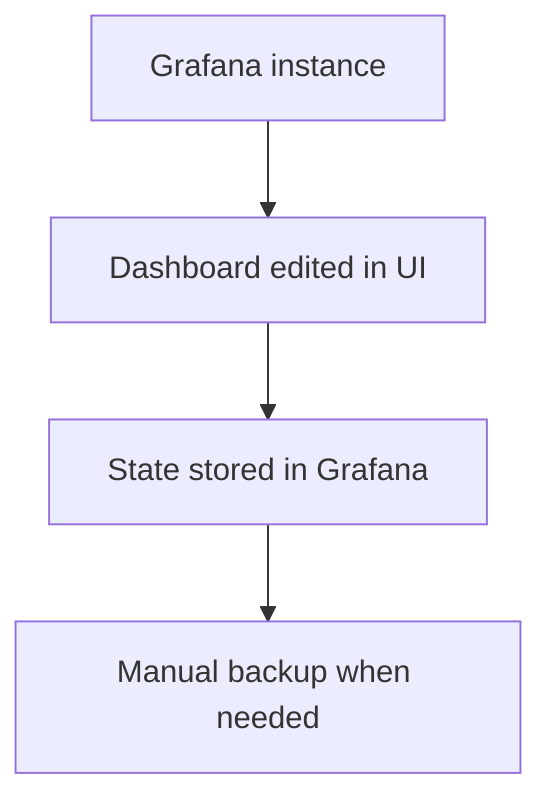
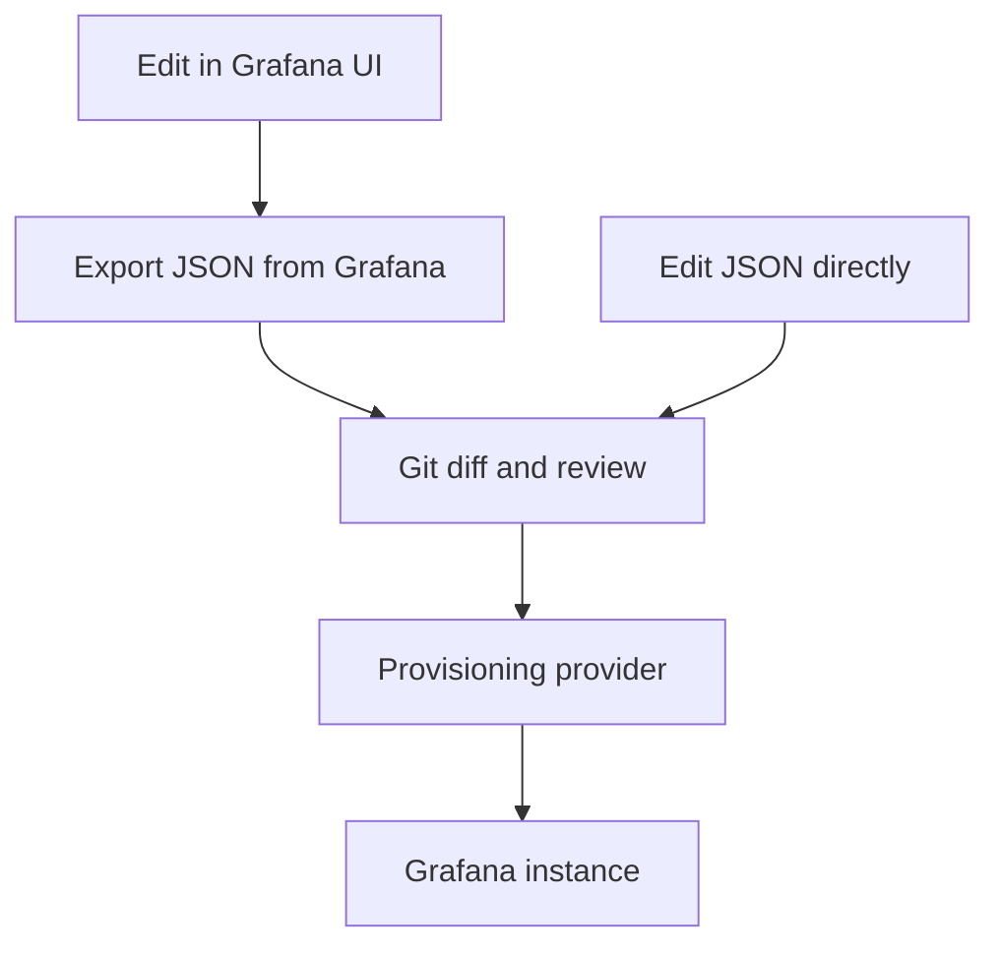
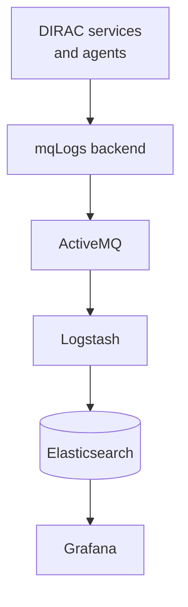
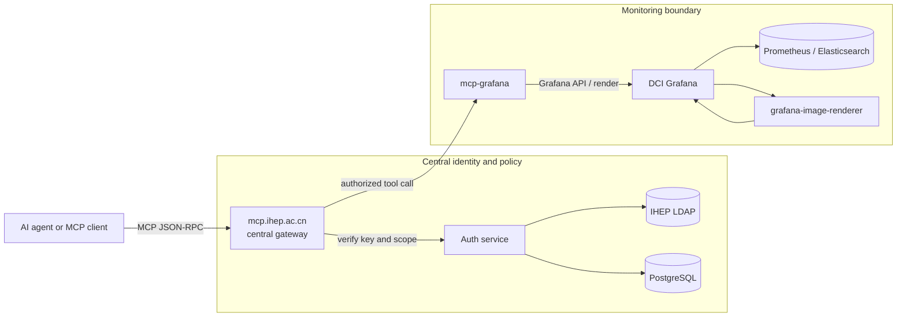
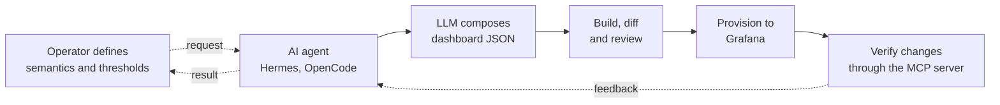

<!-- transition: slide-up -->


## Monitoring upgrades for the JUNO DCI
#### AI workflow for monitoring systems
<br>

**Xiao Han** on behalf of the DCI Group · <a href="mailto:hanx@ihep.ac.cn">hanx@ihep.ac.cn</a>

<br>

**28th JUNO Collaboration Meeting** · 20 July 2026 · *IHEP, Beijing*

<a href="https://github.com/hanx-hep/28th-junocm-dci" class="ns-c-iconlink"><mdi-github /> Slides</a>
 · <a href="https://dci-grafana.ihep.ac.cn/" class="ns-c-iconlink"><mdi-view-dashboard-outline /> DCI Grafana</a>
 · <a href="https://hanx-hep.github.io/27th-junocm-dci/" class="ns-c-iconlink"><mdi-history /> 27th report</a>


<!--
Timing: 0:30

Good afternoon. I am Xiao Han, and I am speaking on behalf of the DCI Group. Today I will present our recent work on monitoring for JUNO distributed computing. This report covers dashboard configuration in Git, access to Grafana through MCP, and central component logs. I will also show how an AI agent can help build and check dashboards. The main subject is the workflow from monitoring data to diagnosis and operator action.
-->
---
layout: top-title
color: orange-light
align: c
---

:: title ::

# Overview

:: content ::

<!-- <div class="lead text-center mt-3"> -->
Monitoring is becoming an increasingly important part of Distributed Computing Infrastructure.
It supports JUNO DCI data processing through alerts, fault localization, and recovery.
<!-- </div> -->

<div class="takeaway mt-6">
<strong>Three updates</strong>: dashboard JSON in Git; centralized component logs; MCP access to Grafana
</div>

<div class="three-cards mt-8">
  <div class="story-card">
    <mdi-source-branch class="story-icon" />
    <h2>Reproducible</h2>
    <p>Dashboard JSON and provisioning live in Git, so changes can be reviewed and deployments reconstructed.</p>
  </div>
  <div class="story-card">
    <mdi-layers-search class="story-icon" />
    <h2>Diagnosable</h2>
    <p>Metrics show the problem; centralized component logs provide the event-level context behind it.</p>
  </div>
  <div class="story-card">
    <mdi-robot-outline class="story-icon" />
    <h2>Accessible</h2>
    <p>AI agents access monitoring data through the IHEP MCP gateway.</p>
  </div>
</div>


<!--
Timing: 0:55

Here is the overview. Monitoring now does more than display charts. It supports JUNO data reprocessing. It helps us raise alerts, locate faults, and recover services. We made three updates. First, dashboard JSON is stored in Git. Second, agents can access Grafana through MCP. Third, component logs are collected in one place. Together, these updates make the monitoring system easier to review, use, and maintain.
-->
---
layout: section
color: cyan-light
---

# 1 · Make dashboards reproducible


<!--
Timing: 0:10

I will start with dashboard configuration. The goal is to store dashboard definitions in Git and load them into Grafana in a standard way.
-->
---
layout: top-title-two-cols
color: cyan-light
align: c-l-l
---

:: title ::

# Dashboards are stored in a Git repository

:: left ::

## Before · instance state



<div class="takeaway compact mt-5">
    Dashboard data were stored in grafana.db, making individual changes difficult to review, reproduce, or transfer.
</div>

:: right ::

## Now · delivery path



<div class="takeaway compact mt-5">
Each dashboard is stored as JSON in the Git repository.
</div>


<!--
Timing: 1:00

The left side shows the old method. We edited a dashboard in the Grafana UI. Grafana stored the result in its database. We made a backup when needed. This worked for recovery, but it did not provide a review process for each change. The right side shows the current method. We can still edit a dashboard in the UI, or edit its JSON directly. We then review the JSON diff in Git. The provisioning provider loads the reviewed file into Grafana. Git now stores the dashboard definition.
-->
---
layout: top-title
color: cyan-light
align: c
---

:: title ::

# Dashboards are stored in a Git repository

:: content ::

<div class="provider-grid mt-4">
  <div class="provider"><strong>10</strong><span>Admin</span></div>
  <div class="provider"><strong>9</strong><span>DIRAC</span></div>
  <div class="provider"><strong>6</strong><span>TPC</span></div>
  <div class="provider"><strong>4</strong><span>User</span></div>
  <div class="provider"><strong>2</strong><span>Shift</span></div>
</div>

<div class="delivery-loop mt-8">
  <div><small>CREATE</small><strong>UI or agent</strong></div>
  <mdi-arrow-right />
  <div><small>CAPTURE</small><strong>Dashboard JSON</strong></div>
  <mdi-arrow-right />
  <div><small>CONTROL</small><strong>Git review</strong></div>
  <mdi-arrow-right />
  <div><small>RECONCILE</small><strong>30 s refresh</strong></div>
</div>

<div class="two-notes mt-8">
  <div><strong>31 dashboard files</strong><br/>Five providers reconstruct the current folder layout from version-controlled JSON.</div>
  <div class="warning-note"><strong>Guard against drift</strong><br/><code>allowUiUpdates: true</code> keeps UI editing convenient; export → review → commit must remain the return path to Git.</div>
</div>


<!--
Timing: 1:05

The repository now has 31 dashboard files. They are grouped under five providers: Admin, DIRAC, TPC, User, and Shift. The workflow has four steps. We create a dashboard, capture it as JSON, review it in Git, and let Grafana load it. Grafana checks the provider every 30 seconds. UI editing is still enabled. So an edit made in Grafana must come back to Git. We export it, review it, and commit it. Otherwise, Grafana and the repository can contain different versions.
-->
---
layout: top-title-two-cols
color: cyan-light
align: c-l-l
---

:: title ::

# Panel configuration details

:: left ::

### 1. Register a provisioning provider

```yaml
# grafana/provisioning/dashboards/dashboards.yaml
apiVersion: 1

providers:
  - name: tpc
    orgId: 1
    folder: TPC
    type: file
    updateIntervalSeconds: 30
    allowUiUpdates: true
    options:
      path: /etc/grafana/provisioning/dashboards/tpc
...
```

:: right ::

### 2. Mount the repository into Grafana

```yaml
# docker-compose.yml
services:
  grafana-server:
    volumes:
      - /home/docker/grafana/provisioning:
          /etc/grafana/provisioning
    environment:
      - GF_RENDERING_SERVER_URL=
          http://grafana-renderer:8081/render
```

<br/>

### 3. Export all dashboards from grafana.db

<!--
Timing: 0:50

This slide shows the main configuration steps. First, we register a file-based provisioning provider. It points to the TPC dashboard directory and checks for updates every 30 seconds. Second, we mount the provisioning directory into the Grafana container. Third, we export the existing dashboards from grafana.db and save them as JSON files. After these steps, Grafana can load the dashboard definitions from the repository.
-->
---
layout: section
color: lime-light
---

# 2 · Save component logs to database


<!--
Timing: 0:10

The third part is component logs. Metrics show that a service changed. Logs help us find the component event related to that change.
-->
---
layout: top-title-two-cols
color: lime-light
align: c-lt-lt
---

:: title ::

# Central logs close the context gap

:: left ::

## DIRAC configuration

JUNO DIRAC runs more than **60 components**. By default, their logs are written and rotated on local disks.

```text
# /opt/dirac/etc/CAS_Prod.cfg
Logging
{
  DefaultServicesBackends = stdout
  DefaultServicesBackends += mqLogs

  DefaultAgentsBackends = stdout
  DefaultAgentsBackends += mqLogs
}
```

<div class="takeaway compact mt-4">
Adding <code>mqLogs</code> enables central log delivery for both services and agents, while <code>stdout</code> remains enabled.
</div>

:: right ::

## Central log pipeline



<div class="takeaway compact mt-2">
ActiveMQ transports; Logstash parses; Elasticsearch stores; Grafana queries and displays.
</div>


<!--
Timing: 1:05

JUNO DIRAC runs more than 60 components. By default, each component writes logs to its local disk. In CAS_Prod.cfg, we keep stdout and add mqLogs for both services and agents. The mqLogs backend sends the messages to ActiveMQ. Logstash reads and parses them, then writes them to Elasticsearch. Grafana queries this central store. This configuration gives services and agents the same log path while keeping local output available.
-->
---
layout: top-title-two-cols
color: lime-light
align: c-l-l
---

:: title ::

# Component Logs follows the triage sequence

:: left ::

## Triage in three steps

<div class="triage-list mt-5">
  <div><small>1 · DISTRIBUTION</small><strong>Is the error mix abnormal?</strong><span>Compare information, warning, and error volume.</span></div>
  <div><small>2 · TIMELINE</small><strong>When did the change begin?</strong><span>Narrow the relevant investigation window.</span></div>
  <div><small>3 · RECORDS</small><strong>Which message is actionable?</strong><span>Inspect individual component log records.</span></div>
</div>

:: right ::

<div class="dashboard-frame component-dashboard-frame">
  <iframe
    src="https://dci-grafana.ihep.ac.cn/d/bfgu666p30xdsb/component-logs?orgId=1&from=now-70d&to=now-69d&timezone=browser&var-Category=$__all&var-Name=$__all&var-Level=$__all&kiosk"
    scrolling="yes"
    class="component-dashboard-iframe"
  ></iframe>
</div>

<div class="text-center mt-3">
  <a href="https://dci-grafana.ihep.ac.cn/d/bfgu666p30xdsb/component-logs?orgId=1&from=now-70d&to=now-69d&timezone=browser&var-Category=$__all&var-Name=$__all&var-Level=$__all&kiosk"><mdi-open-in-new /> Open full dashboard</a>
</div>


<!--
Timing: 1:10

This is the live Component Logs dashboard. It may load slowly, so I will wait for a moment. The left side shows the three investigation steps. The live dashboard is on the right, and we can scroll inside it.

[Demo: wait for the dashboard, then scroll through the three panels.]

The first panel shows the number of information, warning, and error messages. The second panel shows how that number changes over time. The third panel shows individual records. We first check the message levels. Then we select a time window. Finally, we read the related records. The Category, Name, and Level filters apply to all three panels.
-->
---
layout: section
color: purple-light
---

# 3 · Give agents controlled access


<!--
Timing: 0:10

The second part is MCP access. An agent can use monitoring data, but it must pass through authentication and authorization checks.
-->
---
layout: top-title
color: purple-light
align: c
---

:: title ::

# MCP adds a controlled machine interface to Grafana

:: content ::



<div class="two-notes compact-notes mt-2">
  <div><strong>Policy stays centralized</strong><br/>One authenticated gateway enforces identity and scope.</div>
  <div><strong>Grafana stays behind the boundary</strong><br/><code>mcp-grafana</code> adapts dashboard metadata, queries, and rendering.</div>
</div>


<!--
Timing: 1:10

The client does not connect to Grafana directly. It sends an MCP request to mcp.ihep.ac.cn. This is the central gateway. The gateway checks the API key and its scope. The authentication service uses IHEP LDAP and PostgreSQL. If the request is allowed, the gateway sends the tool call to mcp-grafana. This service uses the Grafana API and the rendering interface. Grafana reads data from Prometheus and Elasticsearch. It can also use the image renderer. In this design, identity and policy stay at the central gateway. Grafana operations stay in the mcp-grafana service.
-->
---
layout: top-title
color: purple-light
align: c
---

:: title ::

# From an operational question to evidence

:: content ::

<div class="question-flow mt-6">
  <div class="flow-step"><small>1 · ASK</small><strong>“Why is TPC push failing for a site pair?”</strong></div>
  <mdi-arrow-right />
  <div class="flow-step"><small>2 · AUTHORIZE</small><strong>Gateway verifies key and scope</strong></div>
  <mdi-arrow-right />
  <div class="flow-step"><small>3 · INSPECT</small><strong>Query data and render the relevant panel</strong></div>
  <mdi-arrow-right />
  <div class="flow-step"><small>4 · EXPLAIN</small><strong>Return evidence and the next diagnostic step</strong></div>
</div>

<div class="evidence-grid mt-8">
  <div><mdi-magnify /><strong>Find dashboards</strong><span><code>search_dashboards</code><br/><code>get_dashboard_summary</code></span></div>
  <div><mdi-code-json /><strong>Read queries and data</strong><span><code>get_dashboard_panel_queries</code><br/><code>query_prometheus</code></span></div>
  <div><mdi-image-search-outline /><strong>Return visual evidence</strong><span><code>get_panel_image</code><br/><code>generate_deeplink</code></span></div>
</div>

<div class="takeaway mt-7">
These read tools cover dashboard discovery, query inspection, and panel rendering. Write operations still require explicit authorization.
</div>


<!--
Timing: 1:00

Here is one example. A user asks why TPC push transfers are failing for a site pair. First, the gateway checks the user and the requested scope. Then the agent can use search_dashboards and get_dashboard_summary to find the dashboard. It can read panel queries with get_dashboard_panel_queries and query Prometheus when needed. It can return a panel image with get_panel_image or a Grafana link with generate_deeplink. These are actual tools returned by the current IHEP MCP tools/list response. They support inspection and explanation. Write operations still need explicit authorization.
-->
---
layout: section
color: orange-light
---

# 4 · AI workflow

<!--
Timing: 0:10

The last part shows how an AI agent can support the dashboard workflow from creation to verification.
-->
---
layout: top-title
color: orange-light
align: c
---

:: title ::

# AI assistance throughout the monitoring workflow

:: content ::



<div class="two-notes mt-8">
  <div><strong>Automation</strong><br/>The agent repeats panel structures, queries, transformations, variables, and layouts across a test matrix.</div> <div><strong>Human control</strong><br/>The operator defines domain meaning and grading thresholds, approves the result, and selects operational actions.</div>
</div>

<div class="takeaway mt-8">
The result is not only a dashboard generated by AI. <strong>AI can support each stage of the monitoring workflow.</strong>
</div>


<!--
Timing: 1:00

The operator starts by defining the meaning of the dashboard and its thresholds. The agent receives this request and creates the dashboard JSON. We build the result and review the Git diff. The reviewed file is then provisioned to Grafana. The agent can check the result through the MCP server. If a problem is found, the result goes back to the agent for another change. The agent handles repeated work, such as panel structures, queries, variables, and layouts. The operator still defines the meaning, approves the result, and decides what action to take.
-->
---
layout: top-title
color: orange-light
align: c
---

:: title ::

# TPC transfer matrix

:: content ::

<div class="dashboard-frame tpc-dashboard-frame">
  <iframe
    src="https://dci-grafana.ihep.ac.cn/d/tpc-transfer-monitoring/tpc-transfer-monitoring?var-timeInterval=1d&orgId=1&from=now-14d&to=now-13d&timezone=browser&var-srcsite=$__all&var-dessite=$__all&var-success=$__all&var-copymode=$__all&refresh=1d&kiosk"
    scrolling="yes"
    class="tpc-dashboard-iframe"
  ></iframe>
</div>

<div class="dashboard-footer mt-3">
  <span>Based on <strong>Albert Dzakhoev's work</strong>, AI was used to improve matrix sorting and add panels showing the average success rate.</span>
  <!-- <a href="https://dci-grafana.ihep.ac.cn/d/tpc-transfer-monitoring/tpc-transfer-monitoring?var-timeInterval=1d&orgId=1&from=now-7d&to=now&timezone=browser&var-srcsite=$__all&var-dessite=$__all&var-success=$__all&var-copymode=$__all&kiosk"><mdi-open-in-new /> Open full dashboard</a> -->
</div>


<!--
Timing: 1:15

This is the live TPC transfer matrix. It is based on Albert Dzakhoev's work. We used AI to improve the sorting and add panels for the average success rate. The dashboard covers pull, push, streamed, and combined transfer modes.

[Demo: scroll through the matrix and compare two transfer modes.]

A single failed transfer is one event. A repeated row or column can point to a site problem. A pattern in one mode can point to a transfer-method problem. The average success rate helps us see whether a problem is short or continues over time. The matrix gives us a summary of many transfer tests.
-->
---
layout: top-title-two-cols
color: orange-light
align: c-l-l
---

:: title ::

# Delivered now, with a clear next increment

:: left ::

## Delivered

<div class="status-stack">
  <div><mdi-check-circle-outline /><span><strong>Dashboard provisioning</strong><br/>31 JSON dashboards under five providers</span></div>
  <div><mdi-check-circle-outline /><span><strong>Controlled MCP path</strong><br/>Central gateway to <code>mcp-grafana</code></span></div>
  <div><mdi-check-circle-outline /><span><strong>Central component logs</strong><br/>Three complementary diagnostic panels</span></div>
</div>

:: right ::

## Next increment

<div class="status-stack next">
  <div><mdi-arrow-right-circle-outline /><span><strong>Actionable alerts</strong><br/>Thresholds, ownership, and response links</span></div>
  <div><mdi-arrow-right-circle-outline /><span><strong>Dashboard release checks</strong><br/>Build, schema, and screenshot smoke tests</span></div>
  <div><mdi-arrow-right-circle-outline /><span><strong>Scoped MCP operations</strong><br/>Read-first tools with explicit authorization</span></div>
  <div><mdi-arrow-right-circle-outline /><span><strong>Upgrade SAM Test</strong><br/>Both probing and monitoring</span></div>
</div>


<!--
Timing: 1:00

The left side lists the work that is available now. We have 31 provisioned dashboard files, the TPC transfer view, MCP access to Grafana, and central component logs. The right side lists the next steps. We need alerts with owners and response links. We need checks for dashboard builds, schemas, and screenshots. MCP operations should start with read-only access and clear authorization. We also want links from metrics to logs that keep the site, component, and time range. These steps will improve the current workflow.
-->
---
layout: top-title
color: orange-light
align: c
---

:: title ::

# Summary

:: content ::

<div class="three-cards takeaway-cards mt-8">
  <div class="story-card"><strong>1</strong><h2>Reproducible</h2><p>Git and provisioning turn dashboard changes into reviewable, reconstructable configuration.</p></div>
  <div class="story-card"><strong>2</strong><h2>Diagnosable</h2><p>TPC views expose patterns; centralized logs explain the component events behind them.</p></div>
  <div class="story-card"><strong>3</strong><h2>Accessible</h2><p>The same Grafana evidence serves operators directly and agents through the IHEP MCP gateway.</p></div>
</div>

<div class="closing-line mt-12">
The key upgrade is not another dashboard.<br/>
It is a <strong>shorter, controlled path from signal to action</strong>.
</div>


<!--
Timing: 0:50

I have three takeaways. First, Git and provisioning let us review and restore dashboard definitions. Second, TPC views and component logs provide data for diagnosis. Third, operators and agents can use the same Grafana data through different access paths. Operators use Grafana directly. Agents use the IHEP MCP gateway. The main update is not one dashboard. It is the workflow from a monitoring signal to an operator action.
-->
---
layout: cover
color: navy
loop: true
title: Questions
---


## Thank you. Questions?

**Xiao Han · IHEP, CC**<br/>
DCI Group · JUNO Collaboration

<a href="https://dci-grafana.ihep.ac.cn/" class="ns-c-iconlink"><mdi-view-dashboard-outline /> dci-grafana.ihep.ac.cn</a>
 · <a href="https://github.com/hanx-hep/28th-junocm-dci" class="ns-c-iconlink"><mdi-github /> slides & source</a>

<!--
Timing: 0:15

That is the end of my report. Thank you. I am ready to take questions.
-->
